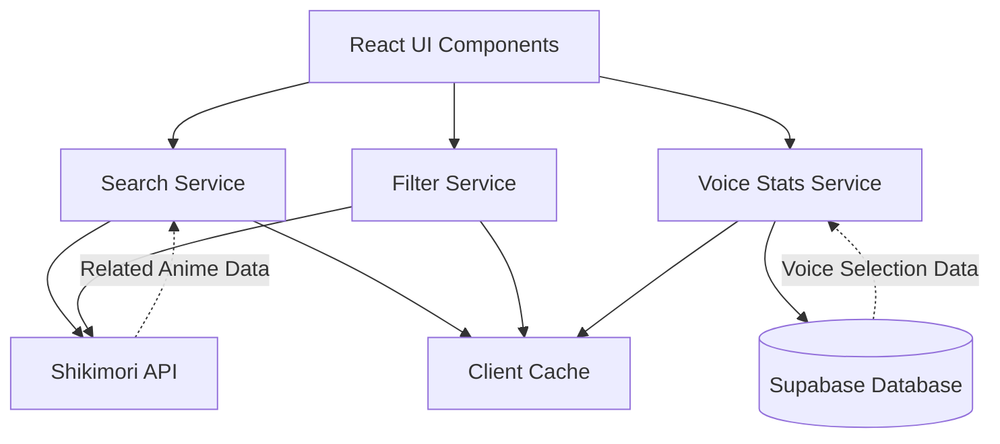

# Design Document: Advanced Search and Voice Stats

## Overview

Этот дизайн описывает реализацию трех основных функций для улучшения пользовательского опыта поиска и просмотра аниме:

1. **Улучшенная система поиска** - интеграция с Shikimori API для получения связанных аниме (сезоны, сиквелы, приквелы) с правильной сортировкой и группировкой
2. **Статистика озвучек с рекомендациями** - система отслеживания выбора озвучек пользователями и отображение популярности для каждого аниме
3. **Система фильтров** - расширенная фильтрация по жанрам, году, типу и статусу с возможностью комбинирования

Система интегрируется с существующей React + TypeScript кодовой базой, использует Supabase для хранения данных и Shikimori API для получения информации об аниме.

## Architecture

### High-Level Architecture



### Component Layers

1. **Presentation Layer** (React Components)
   - `SearchBar` - поисковая строка с debounce
   - `SearchResults` - отображение результатов с группировкой
   - `FilterPanel` - панель фильтров
   - `VoiceStatsTooltip` - всплывающая подсказка со статистикой озвучек
   - `RelatedAnimeGroup` - группа связанных аниме

2. **Service Layer** (Business Logic)
   - `searchService` - логика поиска и группировки
   - `voiceStatsService` - логика статистики озвучек
   - `filterService` - логика фильтрации
   - `shikimoriService` (existing) - интеграция с Shikimori API

3. **Data Layer**
   - Supabase tables для хранения выборов озвучек
   - React Query для кэширования и управления состоянием
   - LocalStorage для кэширования результатов поиска

## Components and Interfaces

### 1. Search Service

#### Interface

```typescript
interface RelatedAnime {
  relation: 'sequel' | 'prequel' | 'side_story' | 'alternative' | 'summary' | 'parent_story' | 'spin_off';
  anime: Anime;
}

interface AnimeWithRelated extends Anime {
  related?: RelatedAnime[];
}

interface GroupedAnime {
  main: AnimeWithRelated;
  related: AnimeWithRelated[];
  chronologicalOrder: number[];
}

interface SearchService {
  /**
   * Поиск аниме с группировкой связанных
   */
  searchWithGrouping(query: string, options?: SearchOptions): Promise<GroupedAnime[]>;
  
  /**
   * Получить связанные аниме для конкретного аниме
   */
  getRelatedAnime(animeId: number): Promise<RelatedAnime[]>;
  
  /**
   * Сортировать связанные аниме в хронологическом порядке
   */
  sortChronologically(animes: AnimeWithRelated[]): AnimeWithRelated[];
}

interface SearchOptions {
  limit?: number;
  includeRelated?: boolean;
  cacheTimeout?: number;
}
```

#### Implementation Details

**Получение связанных аниме:**
- Shikimori API предоставляет endpoint `/api/animes/:id/related` для получения связанных аниме
- Ответ содержит массив объектов с полями `relation` (тип связи) и `anime` (данные аниме)
- Типы связей: sequel, prequel, side_story, alternative, summary, parent_story, spin_off

**Группировка:**
1. Выполнить основной поиск через Shikimori API
2. Для каждого результата получить связанные аниме
3. Определить "главное" аниме в группе (обычно первое по дате выхода или parent_story)
4. Сгруппировать связанные аниме вокруг главного
5. Удалить дубликаты (если аниме появляется в нескольких группах, оставить в наиболее релевантной)

**Хронологическая сортировка:**
1. Использовать поле `aired_on` для определения даты выхода
2. Учитывать типы связей (prequel всегда раньше sequel)
3. Построить граф зависимостей и выполнить топологическую сортировку
4. Для циклических зависимостей использовать дату выхода как fallback

**Кэширование:**
- Кэшировать результаты поиска на 5 минут
- Кэшировать связанные аниме на 1 час (редко меняются)
- Использовать React Query для управления кэшем
- Ключ кэша: `['search', query, filters]`

### 2. Voice Stats Service

#### Database Schema

```sql
-- Таблица для хранения выборов озвучек пользователями
CREATE TABLE voice_selections (
  id UUID PRIMARY KEY DEFAULT uuid_generate_v4(),
  user_id UUID NOT NULL REFERENCES auth.users(id) ON DELETE CASCADE,
  anime_id INTEGER NOT NULL,
  voice_track_name TEXT NOT NULL,
  selected_at TIMESTAMP WITH TIME ZONE DEFAULT NOW(),
  view_started BOOLEAN DEFAULT FALSE,
  view_duration_seconds INTEGER DEFAULT 0,
  last_updated TIMESTAMP WITH TIME ZONE DEFAULT NOW(),
  
  -- Уникальность по комбинации пользователь + аниме + озвучка
  UNIQUE(user_id, anime_id, voice_track_name)
);

-- Индексы для быстрого получения статистики
CREATE INDEX idx_voice_selections_anime_id ON voice_selections(anime_id);
CREATE INDEX idx_voice_selections_voice_track ON voice_selections(voice_track_name);
CREATE INDEX idx_voice_selections_user_anime ON voice_selections(user_id, anime_id);

-- Материализованное представление для агрегированной статистики
CREATE MATERIALIZED VIEW voice_stats_aggregated AS
SELECT 
  anime_id,
  voice_track_name,
  COUNT(DISTINCT user_id) as user_count,
  COUNT(DISTINCT CASE WHEN view_started THEN user_id END) as viewers_count,
  AVG(view_duration_seconds) as avg_view_duration
FROM voice_selections
GROUP BY anime_id, voice_track_name;

-- Индекс для быстрого поиска по anime_id
CREATE INDEX idx_voice_stats_anime ON voice_stats_aggregated(anime_id);

-- Функция для обновления материализованного представления
CREATE OR REPLACE FUNCTION refresh_voice_stats()
RETURNS void AS $$
BEGIN
  REFRESH MATERIALIZED VIEW CONCURRENTLY voice_stats_aggregated;
END;
$$ LANGUAGE plpgsql;
```

#### Interface

```typescript
interface VoiceSelection {
  id: string;
  user_id: string;
  anime_id: number;
  voice_track_name: string;
  selected_at: string;
  view_started: boolean;
  view_duration_seconds: number;
  last_updated: string;
}

interface VoiceStats {
  anime_id: number;
  voice_track_name: string;
  user_count: number;
  viewers_count: number;
  avg_view_duration: number;
  percentage: number; // Вычисляется на клиенте
}

interface VoiceStatsService {
  /**
   * Получить статистику озвучек для аниме
   */
  getVoiceStats(animeId: number): Promise<VoiceStats[]>;
  
  /**
   * Записать выбор озвучки пользователем
   */
  recordVoiceSelection(animeId: number, voiceTrackName: string): Promise<void>;
  
  /**
   * Обновить информацию о начале просмотра
   */
  markViewStarted(animeId: number, voiceTrackName: string): Promise<void>;
  
  /**
   * Обновить длительность просмотра
   */
  updateViewDuration(animeId: number, voiceTrackName: string, durationSeconds: number): Promise<void>;
}
```

#### Implementation Details

**Запись выбора озвучки:**
1. При выборе озвучки в Kodik Player вызвать `recordVoiceSelection`
2. Использовать `UPSERT` (INSERT ... ON CONFLICT UPDATE) для обновления существующей записи
3. Если пользователь не авторизован, не записывать выбор (только показывать статистику)

**Отслеживание просмотра:**
1. При начале воспроизведения вызвать `markViewStarted`
2. Периодически (каждые 30 секунд) обновлять `view_duration_seconds`
3. Использовать debounce для минимизации запросов к БД

**Получение статистики:**
1. Запросить данные из материализованного представления `voice_stats_aggregated`
2. Вычислить проценты на клиенте (user_count / total_users * 100)
3. Отсортировать по убыванию `user_count`
4. Кэшировать на 5 минут

**Обновление материализованного представления:**
- Обновлять каждые 5 минут через cron job или pg_cron
- Использовать `REFRESH MATERIALIZED VIEW CONCURRENTLY` для избежания блокировок

### 3. Filter Service

#### Interface

```typescript
interface FilterOptions {
  genres?: number[]; // IDs жанров
  yearFrom?: number;
  yearTo?: number;
  kind?: AnimeKind[];
  status?: AnimeStatus[];
}

type AnimeKind = 'tv' | 'movie' | 'ova' | 'ona' | 'special' | 'music';
type AnimeStatus = 'anons' | 'ongoing' | 'released';

interface FilterService {
  /**
   * Применить фильтры к поиску
   */
  applyFilters(query: string, filters: FilterOptions): Promise<Anime[]>;
  
  /**
   * Получить доступные жанры
   */
  getAvailableGenres(): Promise<AnimeGenre[]>;
  
  /**
   * Сериализовать фильтры в URL
   */
  serializeFilters(filters: FilterOptions): string;
  
  /**
   * Десериализовать фильтры из URL
   */
  deserializeFilters(urlParams: string): FilterOptions;
}
```

#### Implementation Details

**Применение фильтров:**
1. Построить query string для Shikimori API с параметрами фильтрации
2. Shikimori API поддерживает параметры:
   - `genre` - ID жанра (можно указать несколько через запятую)
   - `season` - сезон и год (например, `winter_2024`)
   - `kind` - тип аниме
   - `status` - статус
3. Отправить запрос к `/api/animes` с параметрами
4. Кэшировать результаты с ключом, включающим фильтры

**Получение жанров:**
1. Запросить список жанров из `/api/genres`
2. Кэшировать на 24 часа (редко меняются)
3. Отобразить в UI как чекбоксы или мультиселект

**URL сериализация:**
1. Использовать URLSearchParams для сериализации
2. Формат: `?genres=1,2,3&yearFrom=2020&yearTo=2024&kind=tv,movie&status=released`
3. При загрузке страницы десериализовать и применить фильтры
4. Обновлять URL при изменении фильтров (history.pushState)

### 4. UI Components

#### SearchBar Component

```typescript
interface SearchBarProps {
  onSearch: (query: string, filters: FilterOptions) => void;
  initialQuery?: string;
  initialFilters?: FilterOptions;
}

const SearchBar: React.FC<SearchBarProps> = ({ onSearch, initialQuery, initialFilters }) => {
  const [query, setQuery] = useState(initialQuery || '');
  const [filters, setFilters] = useState<FilterOptions>(initialFilters || {});
  const [showFilters, setShowFilters] = useState(false);
  
  // Debounce поиска на 300ms
  const debouncedSearch = useDebounce(query, 300);
  
  useEffect(() => {
    if (debouncedSearch || Object.keys(filters).length > 0) {
      onSearch(debouncedSearch, filters);
    }
  }, [debouncedSearch, filters]);
  
  // ... остальная логика
};
```

#### VoiceStatsTooltip Component

```typescript
interface VoiceStatsTooltipProps {
  animeId: number;
  currentVoiceTrack?: string;
}

const VoiceStatsTooltip: React.FC<VoiceStatsTooltipProps> = ({ animeId, currentVoiceTrack }) => {
  const { data: stats, isLoading } = useQuery({
    queryKey: ['voiceStats', animeId],
    queryFn: () => voiceStatsService.getVoiceStats(animeId),
    staleTime: 5 * 60 * 1000, // 5 минут
  });
  
  return (
    <div className="voice-stats-container">
      <div className="voice-stats-trigger">
        Какую озвучку выбрать? ℹ️
      </div>
      <div className="voice-stats-tooltip">
        {isLoading ? (
          <div>Загрузка...</div>
        ) : stats && stats.length > 0 ? (
          <div>
            <h4>Популярные озвучки:</h4>
            {stats.map(stat => (
              <div key={stat.voice_track_name} className="voice-stat-item">
                <span>{stat.voice_track_name}</span>
                <div className="progress-bar">
                  <div style={{ width: `${stat.percentage}%` }} />
                </div>
                <span>{stat.percentage.toFixed(1)}% ({stat.user_count} пользователей)</span>
              </div>
            ))}
          </div>
        ) : (
          <div>Пока нет данных о выборе озвучек</div>
        )}
      </div>
    </div>
  );
};
```

#### RelatedAnimeGroup Component

```typescript
interface RelatedAnimeGroupProps {
  group: GroupedAnime;
  onAnimeClick: (anime: Anime) => void;
}

const RelatedAnimeGroup: React.FC<RelatedAnimeGroupProps> = ({ group, onAnimeClick }) => {
  const [expanded, setExpanded] = useState(false);
  
  return (
    <div className="related-anime-group">
      <div className="main-anime" onClick={() => onAnimeClick(group.main)}>
        
        <div className="anime-info">
          <h3>{group.main.russian}</h3>
          <p>{group.main.kind} • {group.main.score}</p>
        </div>
        {group.related.length > 0 && (
          <button onClick={(e) => { e.stopPropagation(); setExpanded(!expanded); }}>
            {expanded ? '▼' : '▶'} {group.related.length} связанных
          </button>
        )}
      </div>
      
      {expanded && (
        <div className="related-anime-list">
          {group.related.map(anime => (
            <div key={anime.id} className="related-anime-item" onClick={() => onAnimeClick(anime)}>
              
              <div className="anime-info">
                <h4>{anime.russian}</h4>
                <p>{anime.kind} • {anime.aired_on?.substring(0, 4)}</p>
              </div>
            </div>
          ))}
        </div>
      )}
    </div>
  );
};
```

## Data Models

### Extended Anime Type

```typescript
interface AnimeWithRelated extends Anime {
  related?: RelatedAnime[];
  relatedFetched?: boolean;
}

interface RelatedAnime {
  relation: 'sequel' | 'prequel' | 'side_story' | 'alternative' | 'summary' | 'parent_story' | 'spin_off';
  relation_russian: string;
  anime: Anime;
}
```

### Voice Selection Models

```typescript
interface VoiceSelection {
  id: string;
  user_id: string;
  anime_id: number;
  voice_track_name: string;
  selected_at: string;
  view_started: boolean;
  view_duration_seconds: number;
  last_updated: string;
}

interface VoiceStats {
  anime_id: number;
  voice_track_name: string;
  user_count: number;
  viewers_count: number;
  avg_view_duration: number;
  percentage: number;
}

interface VoiceStatsAggregated {
  anime_id: number;
  stats: VoiceStats[];
  total_users: number;
  last_updated: string;
}
```

### Filter Models

```typescript
interface FilterOptions {
  genres?: number[];
  yearFrom?: number;
  yearTo?: number;
  kind?: AnimeKind[];
  status?: AnimeStatus[];
}

type AnimeKind = 'tv' | 'movie' | 'ova' | 'ona' | 'special' | 'music';
type AnimeStatus = 'anons' | 'ongoing' | 'released';

interface FilterState {
  active: boolean;
  options: FilterOptions;
  appliedCount: number;
}
```

## Correctness Properties

