# Design Document: ShiKaraKa Anime Portal

## Overview

ShiKaraKa - это современный аниме-портал, построенный на React с использованием Vite в качестве сборщика. Приложение следует архитектуре клиент-серверного взаимодействия, где клиент (React SPA) взаимодействует с двумя основными backend-сервисами:

1. **Shikimori API** - для получения данных об аниме (поиск, детали, рейтинги)
2. **Supabase** - для аутентификации пользователей и хранения персональных данных (избранное)

Дизайн выполнен в стиле Modern Dark Cinema с темной цветовой схемой (#0a0a0c для фона, #ff0055 для акцентов), что создает кинематографическую атмосферу просмотра.

### Key Design Principles

- **Zero Budget**: Использование только бесплатных сервисов и инструментов
- **Performance First**: Оптимизация загрузки через code splitting, lazy loading и кэширование
- **Mobile First**: Адаптивный дизайн с приоритетом мобильных устройств
- **User Experience**: Плавные переходы, skeleton screens, понятная обработка ошибок

## Architecture

### High-Level Architecture

```mermaid
graph TB
    User[User Browser]
    React[React SPA<br/>Vite + React + Tailwind]
    RQ[React Query<br/>Cache Layer]
    Shikimori[Shikimori API<br/>Anime Data]
    Supabase[Supabase<br/>Auth + Database]
    Vercel[Vercel CDN<br/>Hosting]
    
    User -->|HTTPS| Vercel
    Vercel -->|Serves| React
    React -->|Queries| RQ
    RQ -->|Fetch Anime| Shikimori
    React -->|Auth/Data| Supabase
    
    style React fill:#ff0055,color:#fff
    style RQ fill:#0a0a0c,stroke:#ff0055
    style Supabase fill:#3ecf8e
    style Shikimori fill:#456
```



### Component Architecture


Приложение организовано в модульную структуру компонентов:

```
src/
├── components/
│   ├── layout/
│   │   ├── Header.tsx          # Навигация и поиск
│   │   └── Footer.tsx          # Подвал сайта
│   ├── anime/
│   │   ├── AnimeCard.tsx       # Карточка аниме в сетке
│   │   ├── AnimeGrid.tsx       # Сетка карточек
│   │   ├── AnimeDetails.tsx    # Детальная страница
│   │   └── VideoPlayer.tsx     # Видеоплеер с iframe
│   ├── auth/
│   │   ├── LoginForm.tsx       # Форма входа
│   │   ├── RegisterForm.tsx    # Форма регистрации
│   │   └── AuthModal.tsx       # Модальное окно аутентификации
│   ├── ui/
│   │   ├── SkeletonCard.tsx    # Skeleton для карточки
│   │   ├── Button.tsx          # Переиспользуемая кнопка
│   │   └── ErrorMessage.tsx    # Компонент ошибки
│   └── favorites/
│       └── FavoriteButton.tsx  # Кнопка добавления в избранное
├── hooks/
│   ├── useAnime.ts             # React Query хук для аниме
│   ├── useSearch.ts            # Хук для поиска
│   ├── useAuth.ts              # Хук для аутентификации
│   └── useFavorites.ts         # Хук для избранного
├── services/
│   ├── shikimori.ts            # API клиент для Shikimori
│   └── supabase.ts             # Supabase клиент
├── types/
│   └── anime.ts                # TypeScript типы
└── pages/
    ├── Home.tsx                # Главная страница
    ├── AnimeDetail.tsx         # Страница аниме
    └── Favorites.tsx           # Страница избранного
```

## Components and Interfaces

### 1. Header Component

**Responsibility**: Навигация, поиск и отображение статуса аутентификации

**Interface**:
```typescript
interface HeaderProps {
  onSearch: (query: string) => void;
  isAuthenticated: boolean;
  user: User | null;
}
```

**Behavior**:
- Отображает логотип "ShiKaraKa" с ссылкой на главную
- Содержит поле поиска с debounce (300ms)
- Показывает кнопки "Войти/Регистрация" или имя пользователя
- Адаптивное меню для мобильных устройств


### 2. AnimeCard Component

**Responsibility**: Отображение карточки аниме в сетке

**Interface**:
```typescript
interface AnimeCardProps {
  anime: {
    id: number;
    name: string;
    russian: string;
    image: {
      original: string;
      preview: string;
    };
    score: string;
    aired_on: string;
    kind: string;
  };
  onClick: (id: number) => void;
}
```

**Behavior**:
- Отображает постер с lazy loading
- Показывает название (русское или английское)
- Отображает рейтинг и год выпуска
- Применяет градиент overlay для читаемости текста
- Hover эффект с увеличением и подсветкой
- Клик переводит на страницу деталей

**Styling**:
```css
.anime-card {
  background: #0a0a0c;
  border-radius: 8px;
  overflow: hidden;
  transition: transform 0.3s, box-shadow 0.3s;
}

.anime-card:hover {
  transform: translateY(-4px);
  box-shadow: 0 8px 24px rgba(255, 0, 85, 0.3);
}

.anime-card-gradient {
  background: linear-gradient(to top, rgba(10, 10, 12, 0.9), transparent);
}
```

### 3. AnimeGrid Component

**Responsibility**: Управление сеткой карточек аниме

**Interface**:
```typescript
interface AnimeGridProps {
  animes: Anime[];
  isLoading: boolean;
  error: Error | null;
}
```

**Behavior**:
- Отображает сетку с адаптивным количеством колонок:
  - Desktop (>1024px): 6 колонок
  - Tablet (768-1024px): 4 колонки
  - Mobile (<768px): 2 колонки
- Показывает skeleton screens при загрузке (12 карточек)
- Отображает сообщение об ошибке при неудаче
- Использует CSS Grid для layout


### 4. VideoPlayer Component

**Responsibility**: Встраивание видеоплеера для просмотра аниме

**Interface**:
```typescript
interface VideoPlayerProps {
  shikimoriId: number;
  animeName: string;
}
```

**Behavior**:
- Генерирует iframe URL на основе shikimori_id
- Использует Kodik или Vidoza плеер (автоматический выбор)
- Поддерживает соотношение сторон 16:9 на всех устройствах
- Отображает fallback сообщение при ошибке загрузки

**Implementation**:
```typescript
const VideoPlayer: React.FC<VideoPlayerProps> = ({ shikimoriId, animeName }) => {
  const [error, setError] = useState(false);
  
  // Kodik player URL format
  const playerUrl = `//kodik.info/find-player?shikimoriID=${shikimoriId}`;
  
  return (
    <div className="relative w-full" style={{ paddingBottom: '56.25%' }}>
      {!error ? (
        <iframe
          src={playerUrl}
          className="absolute top-0 left-0 w-full h-full rounded-lg"
          allowFullScreen
          onError={() => setError(true)}
        />
      ) : (
        <div className="absolute top-0 left-0 w-full h-full flex items-center justify-center bg-gray-900 rounded-lg">
          <p className="text-gray-400">Видео временно недоступно</p>
        </div>
      )}
    </div>
  );
};
```

### 5. Authentication Components

**LoginForm & RegisterForm**

**Interface**:
```typescript
interface AuthFormProps {
  onSuccess: () => void;
  onError: (error: string) => void;
}
```

**Behavior**:
- Валидация email (формат) и пароля (минимум 6 символов)
- Отображение ошибок валидации в реальном времени
- Disabled состояние кнопки при отправке
- Интеграция с Supabase Auth

**LoginForm Implementation**:
```typescript
const handleLogin = async (email: string, password: string) => {
  try {
    const { data, error } = await supabase.auth.signInWithPassword({
      email,
      password
    });
    
    if (error) throw error;
    onSuccess();
  } catch (error) {
    onError(error.message);
  }
};
```


### 6. FavoriteButton Component

**Responsibility**: Управление добавлением/удалением аниме из избранного

**Interface**:
```typescript
interface FavoriteButtonProps {
  animeId: number;
  animeName: string;
  isAuthenticated: boolean;
}
```

**Behavior**:
- Проверяет, находится ли аниме в избранном пользователя
- Отображает иконку сердца (заполненное/пустое)
- При клике добавляет/удаляет из Supabase
- Показывает loading состояние при операции
- Скрыта для неаутентифицированных пользователей

**Implementation**:
```typescript
const FavoriteButton: React.FC<FavoriteButtonProps> = ({ 
  animeId, 
  animeName, 
  isAuthenticated 
}) => {
  const { data: favorites, isLoading } = useFavorites();
  const addMutation = useAddFavorite();
  const removeMutation = useRemoveFavorite();
  
  const isFavorite = favorites?.some(f => f.shikimori_id === animeId);
  
  const handleToggle = () => {
    if (isFavorite) {
      removeMutation.mutate(animeId);
    } else {
      addMutation.mutate({ shikimori_id: animeId, anime_name: animeName });
    }
  };
  
  if (!isAuthenticated) return null;
  
  return (
    <button
      onClick={handleToggle}
      disabled={isLoading || addMutation.isLoading || removeMutation.isLoading}
      className="favorite-button"
    >
      <Heart fill={isFavorite ? '#ff0055' : 'none'} stroke="#ff0055" />
    </button>
  );
};
```

## Data Models

### Supabase Database Schema

**profiles table**:
```sql
CREATE TABLE profiles (
  id UUID REFERENCES auth.users(id) PRIMARY KEY,
  username TEXT,
  avatar_url TEXT,
  created_at TIMESTAMP WITH TIME ZONE DEFAULT NOW(),
  updated_at TIMESTAMP WITH TIME ZONE DEFAULT NOW()
);

-- Enable Row Level Security
ALTER TABLE profiles ENABLE ROW LEVEL SECURITY;

-- Policy: Users can view their own profile
CREATE POLICY "Users can view own profile"
  ON profiles FOR SELECT
  USING (auth.uid() = id);

-- Policy: Users can update their own profile
CREATE POLICY "Users can update own profile"
  ON profiles FOR UPDATE
  USING (auth.uid() = id);
```


**favorites table**:
```sql
CREATE TABLE favorites (
  id UUID DEFAULT gen_random_uuid() PRIMARY KEY,
  user_id UUID REFERENCES auth.users(id) ON DELETE CASCADE NOT NULL,
  shikimori_id INTEGER NOT NULL,
  anime_name TEXT NOT NULL,
  added_at TIMESTAMP WITH TIME ZONE DEFAULT NOW(),
  UNIQUE(user_id, shikimori_id)
);

-- Enable Row Level Security
ALTER TABLE favorites ENABLE ROW LEVEL SECURITY;

-- Policy: Users can view their own favorites
CREATE POLICY "Users can view own favorites"
  ON favorites FOR SELECT
  USING (auth.uid() = user_id);

-- Policy: Users can insert their own favorites
CREATE POLICY "Users can insert own favorites"
  ON favorites FOR INSERT
  WITH CHECK (auth.uid() = user_id);

-- Policy: Users can delete their own favorites
CREATE POLICY "Users can delete own favorites"
  ON favorites FOR DELETE
  USING (auth.uid() = user_id);

-- Index for faster queries
CREATE INDEX idx_favorites_user_id ON favorites(user_id);
CREATE INDEX idx_favorites_shikimori_id ON favorites(shikimori_id);
```

### TypeScript Types

**Anime Types**:
```typescript
interface AnimeImage {
  original: string;
  preview: string;
  x96: string;
  x48: string;
}

interface AnimeGenre {
  id: number;
  name: string;
  russian: string;
  kind: string;
}

interface AnimeStudio {
  id: number;
  name: string;
  filtered_name: string;
  real: boolean;
  image: string | null;
}

interface Anime {
  id: number;
  name: string;
  russian: string;
  image: AnimeImage;
  url: string;
  kind: string;
  score: string;
  status: string;
  episodes: number;
  episodes_aired: number;
  aired_on: string;
  released_on: string | null;
  rating: string;
  english: string[];
  japanese: string[];
  synonyms: string[];
  license_name_ru: string | null;
  duration: number;
  description: string;
  description_html: string;
  description_source: string | null;
  franchise: string | null;
  favoured: boolean;
  thread_id: number;
  topic_id: number;
  myanimelist_id: number;
  rates_scores_stats: Array<{ name: number; value: number }>;
  rates_statuses_stats: Array<{ name: string; value: number }>;
  updated_at: string;
  next_episode_at: string | null;
  genres: AnimeGenre[];
  studios: AnimeStudio[];
}
```


**User & Favorites Types**:
```typescript
interface User {
  id: string;
  email: string;
  user_metadata: {
    username?: string;
    avatar_url?: string;
  };
}

interface Profile {
  id: string;
  username: string | null;
  avatar_url: string | null;
  created_at: string;
  updated_at: string;
}

interface Favorite {
  id: string;
  user_id: string;
  shikimori_id: number;
  anime_name: string;
  added_at: string;
}
```

### API Integration

**Shikimori API Service**:
```typescript
const SHIKIMORI_BASE_URL = 'https://shikimori.one/api';

class ShikimoriService {
  // Получить популярные аниме
  async getPopularAnime(page: number = 1, limit: number = 24): Promise<Anime[]> {
    const response = await fetch(
      `${SHIKIMORI_BASE_URL}/animes?page=${page}&limit=${limit}&order=popularity`
    );
    return response.json();
  }
  
  // Поиск аниме
  async searchAnime(query: string, limit: number = 24): Promise<Anime[]> {
    const response = await fetch(
      `${SHIKIMORI_BASE_URL}/animes?search=${encodeURIComponent(query)}&limit=${limit}`
    );
    return response.json();
  }
  
  // Получить детали аниме
  async getAnimeById(id: number): Promise<Anime> {
    const response = await fetch(`${SHIKIMORI_BASE_URL}/animes/${id}`);
    return response.json();
  }
}

export const shikimoriService = new ShikimoriService();
```

**React Query Integration**:
```typescript
// hooks/useAnime.ts
export const usePopularAnime = (page: number = 1) => {
  return useQuery({
    queryKey: ['anime', 'popular', page],
    queryFn: () => shikimoriService.getPopularAnime(page),
    staleTime: 5 * 60 * 1000, // 5 минут
    cacheTime: 10 * 60 * 1000, // 10 минут
  });
};

export const useSearchAnime = (query: string) => {
  return useQuery({
    queryKey: ['anime', 'search', query],
    queryFn: () => shikimoriService.searchAnime(query),
    enabled: query.length > 0,
    staleTime: 5 * 60 * 1000,
  });
};

export const useAnimeDetails = (id: number) => {
  return useQuery({
    queryKey: ['anime', 'details', id],
    queryFn: () => shikimoriService.getAnimeById(id),
    staleTime: 10 * 60 * 1000,
  });
};
```


**Supabase Service**:
```typescript
import { createClient } from '@supabase/supabase-js';

const supabaseUrl = import.meta.env.VITE_SUPABASE_URL;
const supabaseAnonKey = import.meta.env.VITE_SUPABASE_ANON_KEY;

export const supabase = createClient(supabaseUrl, supabaseAnonKey);

// Auth hooks
export const useAuth = () => {
  const [user, setUser] = useState<User | null>(null);
  const [loading, setLoading] = useState(true);
  
  useEffect(() => {
    // Получить текущую сессию
    supabase.auth.getSession().then(({ data: { session } }) => {
      setUser(session?.user ?? null);
      setLoading(false);
    });
    
    // Подписаться на изменения аутентификации
    const { data: { subscription } } = supabase.auth.onAuthStateChange(
      (_event, session) => {
        setUser(session?.user ?? null);
      }
    );
    
    return () => subscription.unsubscribe();
  }, []);
  
  return { user, loading };
};

// Favorites hooks
export const useFavorites = () => {
  const { user } = useAuth();
  
  return useQuery({
    queryKey: ['favorites', user?.id],
    queryFn: async () => {
      const { data, error } = await supabase
        .from('favorites')
        .select('*')
        .eq('user_id', user?.id)
        .order('added_at', { ascending: false });
      
      if (error) throw error;
      return data as Favorite[];
    },
    enabled: !!user,
  });
};

export const useAddFavorite = () => {
  const queryClient = useQueryClient();
  const { user } = useAuth();
  
  return useMutation({
    mutationFn: async (favorite: { shikimori_id: number; anime_name: string }) => {
      const { data, error } = await supabase
        .from('favorites')
        .insert({
          user_id: user?.id,
          shikimori_id: favorite.shikimori_id,
          anime_name: favorite.anime_name,
        })
        .select()
        .single();
      
      if (error) throw error;
      return data;
    },
    onSuccess: () => {
      queryClient.invalidateQueries(['favorites', user?.id]);
    },
  });
};

export const useRemoveFavorite = () => {
  const queryClient = useQueryClient();
  const { user } = useAuth();
  
  return useMutation({
    mutationFn: async (shikimoriId: number) => {
      const { error } = await supabase
        .from('favorites')
        .delete()
        .eq('user_id', user?.id)
        .eq('shikimori_id', shikimoriId);
      
      if (error) throw error;
    },
    onSuccess: () => {
      queryClient.invalidateQueries(['favorites', user?.id]);
    },
  });
};
```


## Correctness Properties

*A property is a characteristic or behavior that should hold true across all valid executions of a system—essentially, a formal statement about what the system should do. Properties serve as the bridge between human-readable specifications and machine-verifiable correctness guarantees.*

### Property Reflection

После анализа acceptance criteria были выявлены следующие тестируемые свойства. Проведена рефлексия для устранения избыточности:

**Объединенные свойства**:
- Свойства 4.2, 4.3, 4.4 (регистрация, вход, сохранение сессии) объединены в одно комплексное свойство аутентификации
- Свойства 7.2, 7.4 (обработка JSON, извлечение ID) объединены в свойство корректной обработки API ответов
- Свойства 9.1, 9.2 (индикаторы загрузки, сообщения об ошибках) объединены в свойство обработки асинхронных состояний

**Исключенные свойства**:
- 10.4 (кэширование) - дублирует 7.6 (React Query кэширование)
- 6.4 (автоматическое создание в auth.users) - часть процесса регистрации, покрыто свойством аутентификации

### Properties

**Property 1: Anime Card Display Completeness**

*For any* anime data received from Shikimori API, when rendered as AnimeCard, the component should display all required fields: poster image, title (russian or name), score, and year (extracted from aired_on).

**Validates: Requirements 1.4**

---

**Property 2: Search Query API Integration**

*For any* non-empty search query string, when submitted through the search field, the system should invoke Shikimori API with the exact query text as a parameter.

**Validates: Requirements 2.1**

---

**Property 3: Search Results Display**

*For any* search results array returned from Shikimori API, the system should render each result as an AnimeCard in the grid layout.

**Validates: Requirements 2.3**

---

**Property 4: Anime Details Navigation**

*For any* anime selected from the grid, the system should navigate to a detail page and display comprehensive information including poster, genres, status, and studio.

**Validates: Requirements 3.1, 3.3**

---

**Property 5: Video Player Initialization**

*For any* anime with a valid shikimori_id, when the detail page loads, the VideoPlayer component should initialize with an iframe URL containing that shikimori_id.

**Validates: Requirements 3.4**

---

**Property 6: Authentication Flow**

*For any* valid email and password combination, when submitted through registration or login forms, the system should successfully authenticate via Supabase and establish a user session.

**Validates: Requirements 4.2, 4.3, 4.4**

---

**Property 7: Invalid Credentials Handling**

*For any* invalid email format or password (less than 6 characters), when submitted through auth forms, the system should reject the submission and display an appropriate error message.

**Validates: Requirements 4.5**

---

**Property 8: Favorite Addition**

*For any* authenticated user and any anime, when the user clicks "Add to list", the system should create a record in the favorites table with the correct user_id and shikimori_id.

**Validates: Requirements 5.2, 6.5**

---

**Property 9: Favorite Removal**

*For any* anime currently in a user's favorites list, when the user clicks "Remove from list", the system should delete the corresponding record from the favorites table.

**Validates: Requirements 5.4**

---

**Property 10: API Response Processing**

*For any* successful response from Shikimori API, the system should correctly parse the JSON data and extract all necessary fields including shikimori_id for video player integration.

**Validates: Requirements 7.2, 7.4**

---

**Property 11: API Error Handling**

*For any* error response from Shikimori API (network failure, 4xx, 5xx status codes), the system should display a user-friendly error message and log the error to console.

**Validates: Requirements 7.3, 9.2, 9.4**

---

**Property 12: React Query Cache Utilization**

*For any* previously fetched anime data, when the user navigates back to a page requesting the same data, React Query should serve the cached data without making a new API request (within the staleTime window).

**Validates: Requirements 7.6**

---

**Property 13: Touch Target Accessibility**

*For all* interactive elements (buttons, cards, links) on touch devices, the clickable area should have a minimum size of 44x44 pixels to ensure comfortable interaction.

**Validates: Requirements 8.5**

---

**Property 14: Async Operation Loading States**

*For any* asynchronous operation (API calls, mutations), while the operation is in progress, the system should display either a Skeleton Screen or a loading indicator to inform the user.

**Validates: Requirements 9.1**


## Error Handling

### Error Categories

**1. Network Errors**
- Shikimori API unavailable
- Timeout errors
- Connection failures

**Handling Strategy**:
```typescript
const handleNetworkError = (error: Error) => {
  console.error('Network error:', error);
  
  return {
    message: 'Не удалось загрузить данные. Проверьте подключение к интернету.',
    retry: true,
    action: 'Попробовать снова'
  };
};
```

**2. Authentication Errors**
- Invalid credentials
- Email already exists
- Session expired

**Handling Strategy**:
```typescript
const handleAuthError = (error: AuthError) => {
  const errorMessages: Record<string, string> = {
    'Invalid login credentials': 'Неверный email или пароль',
    'User already registered': 'Пользователь с таким email уже существует',
    'Email not confirmed': 'Подтвердите email для входа',
  };
  
  return errorMessages[error.message] || 'Ошибка аутентификации';
};
```

**3. Data Validation Errors**
- Invalid email format
- Password too short
- Missing required fields

**Handling Strategy**:
```typescript
const validateEmail = (email: string): string | null => {
  const emailRegex = /^[^\s@]+@[^\s@]+\.[^\s@]+$/;
  if (!emailRegex.test(email)) {
    return 'Введите корректный email адрес';
  }
  return null;
};

const validatePassword = (password: string): string | null => {
  if (password.length < 6) {
    return 'Пароль должен содержать минимум 6 символов';
  }
  return null;
};
```

**4. Video Player Errors**
- Iframe loading failure
- Video source unavailable
- Blocked by content policy

**Handling Strategy**:
```typescript
const VideoPlayerErrorFallback = () => (
  <div className="flex flex-col items-center justify-center h-full bg-gray-900 rounded-lg p-8">
    <AlertCircle className="w-16 h-16 text-gray-500 mb-4" />
    <p className="text-gray-400 text-center mb-4">
      Видео временно недоступно
    </p>
    <p className="text-gray-500 text-sm text-center">
      Попробуйте обновить страницу или вернуться позже
    </p>
  </div>
);
```

### Error Boundaries

**React Error Boundary для глобальных ошибок**:
```typescript
class ErrorBoundary extends React.Component<
  { children: React.ReactNode },
  { hasError: boolean; error: Error | null }
> {
  constructor(props) {
    super(props);
    this.state = { hasError: false, error: null };
  }

  static getDerivedStateFromError(error: Error) {
    return { hasError: true, error };
  }

  componentDidCatch(error: Error, errorInfo: React.ErrorInfo) {
    console.error('Error caught by boundary:', error, errorInfo);
  }

  render() {
    if (this.state.hasError) {
      return (
        <div className="min-h-screen flex items-center justify-center bg-[#0a0a0c]">
          <div className="text-center">
            <h1 className="text-4xl font-bold text-[#ff0055] mb-4">
              Что-то пошло не так
            </h1>
            <p className="text-gray-400 mb-8">
              Произошла непредвиденная ошибка
            </p>
            <button
              onClick={() => window.location.reload()}
              className="px-6 py-3 bg-[#ff0055] text-white rounded-lg hover:bg-[#cc0044]"
            >
              Перезагрузить страницу
            </button>
          </div>
        </div>
      );
    }

    return this.props.children;
  }
}
```


## Testing Strategy

### Dual Testing Approach

Проект использует комбинацию unit-тестов и property-based тестов для обеспечения комплексного покрытия:

- **Unit tests**: Проверяют конкретные примеры, edge cases и интеграционные точки
- **Property tests**: Проверяют универсальные свойства на множестве сгенерированных входных данных

Оба подхода дополняют друг друга: unit-тесты ловят конкретные баги, property-тесты проверяют общую корректность.

### Testing Tools

**Framework**: Vitest (быстрый, совместимый с Vite)
**Property-Based Testing**: fast-check (для JavaScript/TypeScript)
**React Testing**: @testing-library/react
**Mocking**: MSW (Mock Service Worker) для API запросов

**Installation**:
```bash
npm install -D vitest @vitest/ui @testing-library/react @testing-library/jest-dom
npm install -D fast-check msw
```

**Configuration** (vitest.config.ts):
```typescript
import { defineConfig } from 'vitest/config';
import react from '@vitejs/plugin-react';

export default defineConfig({
  plugins: [react()],
  test: {
    environment: 'jsdom',
    setupFiles: ['./src/test/setup.ts'],
    globals: true,
  },
});
```

### Property-Based Test Configuration

- **Minimum iterations**: 100 runs per property test
- **Tag format**: `// Feature: shikaraka-anime-portal, Property {N}: {property_text}`
- Each correctness property must be implemented by a SINGLE property-based test

**Example Property Test**:
```typescript
import fc from 'fast-check';
import { describe, it, expect } from 'vitest';

describe('AnimeCard Component', () => {
  // Feature: shikaraka-anime-portal, Property 1: Anime Card Display Completeness
  it('should display all required fields for any anime data', () => {
    fc.assert(
      fc.property(
        fc.record({
          id: fc.integer({ min: 1 }),
          name: fc.string({ minLength: 1 }),
          russian: fc.string({ minLength: 1 }),
          image: fc.record({
            original: fc.webUrl(),
            preview: fc.webUrl(),
          }),
          score: fc.float({ min: 0, max: 10 }).map(n => n.toFixed(2)),
          aired_on: fc.date().map(d => d.toISOString()),
        }),
        (anime) => {
          const { container } = render(<AnimeCard anime={anime} onClick={() => {}} />);
          
          // Проверяем наличие всех обязательных элементов
          expect(container.querySelector('img')).toBeTruthy();
          expect(container.textContent).toContain(anime.russian || anime.name);
          expect(container.textContent).toContain(anime.score);
          
          const year = new Date(anime.aired_on).getFullYear();
          expect(container.textContent).toContain(year.toString());
        }
      ),
      { numRuns: 100 }
    );
  });
});
```

### Unit Test Examples

**Component Tests**:
```typescript
describe('Header Component', () => {
  it('should display logo with link to home', () => {
    render(<Header onSearch={() => {}} isAuthenticated={false} user={null} />);
    
    const logo = screen.getByText('ShiKaraKa');
    expect(logo).toBeInTheDocument();
    expect(logo.closest('a')).toHaveAttribute('href', '/');
  });
  
  it('should show login button when not authenticated', () => {
    render(<Header onSearch={() => {}} isAuthenticated={false} user={null} />);
    
    expect(screen.getByText('Войти')).toBeInTheDocument();
  });
  
  it('should show user name when authenticated', () => {
    const user = { id: '1', email: 'test@example.com', user_metadata: {} };
    render(<Header onSearch={() => {}} isAuthenticated={true} user={user} />);
    
    expect(screen.getByText('test@example.com')).toBeInTheDocument();
  });
});
```

**Hook Tests**:
```typescript
describe('useAuth Hook', () => {
  it('should return null user when not authenticated', async () => {
    const { result } = renderHook(() => useAuth());
    
    await waitFor(() => {
      expect(result.current.loading).toBe(false);
    });
    
    expect(result.current.user).toBeNull();
  });
});
```

### Integration Tests with MSW

**API Mocking Setup**:
```typescript
import { setupServer } from 'msw/node';
import { rest } from 'msw';

const server = setupServer(
  rest.get('https://shikimori.one/api/animes', (req, res, ctx) => {
    return res(
      ctx.json([
        {
          id: 1,
          name: 'Test Anime',
          russian: 'Тестовое Аниме',
          image: { original: 'https://example.com/image.jpg', preview: 'https://example.com/preview.jpg' },
          score: '8.5',
          aired_on: '2023-01-01',
        },
      ])
    );
  })
);

beforeAll(() => server.listen());
afterEach(() => server.resetHandlers());
afterAll(() => server.close());
```

### Test Coverage Goals

- **Components**: 80%+ coverage
- **Hooks**: 90%+ coverage
- **Services**: 85%+ coverage
- **Critical paths** (auth, favorites): 95%+ coverage

### Edge Cases to Test

1. **Empty search results** - verify "Ничего не найдено" message
2. **Video player failure** - verify fallback message
3. **Network timeout** - verify retry functionality
4. **Invalid email formats** - verify validation errors
5. **Duplicate favorites** - verify unique constraint handling
6. **Session expiration** - verify re-authentication flow


## Performance Optimization

### Code Splitting

**Route-based splitting**:
```typescript
import { lazy, Suspense } from 'react';
import { BrowserRouter, Routes, Route } from 'react-router-dom';

const Home = lazy(() => import('./pages/Home'));
const AnimeDetail = lazy(() => import('./pages/AnimeDetail'));
const Favorites = lazy(() => import('./pages/Favorites'));

function App() {
  return (
    <BrowserRouter>
      <Suspense fallback={<LoadingScreen />}>
        <Routes>
          <Route path="/" element={<Home />} />
          <Route path="/anime/:id" element={<AnimeDetail />} />
          <Route path="/favorites" element={<Favorites />} />
        </Routes>
      </Suspense>
    </BrowserRouter>
  );
}
```

### Image Optimization

**Lazy Loading**:
```typescript
const AnimeCard: React.FC<AnimeCardProps> = ({ anime }) => {
  return (
    <div className="anime-card">
      
      {/* ... */}
    </div>
  );
};
```

**Progressive Image Loading**:
```typescript
const [imageLoaded, setImageLoaded] = useState(false);

<div className="relative">
  {!imageLoaded && <SkeletonImage />}
   setImageLoaded(true)}
    className={imageLoaded ? 'opacity-100' : 'opacity-0'}
    style={{ transition: 'opacity 0.3s' }}
  />
</div>
```

### React Query Optimization

**Prefetching**:
```typescript
const queryClient = useQueryClient();

const handleAnimeHover = (id: number) => {
  // Prefetch anime details on hover
  queryClient.prefetchQuery({
    queryKey: ['anime', 'details', id],
    queryFn: () => shikimoriService.getAnimeById(id),
  });
};
```

**Stale-While-Revalidate Strategy**:
```typescript
useQuery({
  queryKey: ['anime', 'popular'],
  queryFn: getPopularAnime,
  staleTime: 5 * 60 * 1000,      // 5 минут - данные считаются свежими
  cacheTime: 10 * 60 * 1000,     // 10 минут - данные хранятся в кэше
  refetchOnWindowFocus: false,   // Не обновлять при фокусе окна
});
```

### Memoization

**Component Memoization**:
```typescript
const AnimeCard = React.memo<AnimeCardProps>(({ anime, onClick }) => {
  // Component implementation
}, (prevProps, nextProps) => {
  // Custom comparison
  return prevProps.anime.id === nextProps.anime.id;
});
```

**Expensive Calculations**:
```typescript
const AnimeGrid: React.FC<AnimeGridProps> = ({ animes }) => {
  const sortedAnimes = useMemo(() => {
    return [...animes].sort((a, b) => parseFloat(b.score) - parseFloat(a.score));
  }, [animes]);
  
  return <div>{/* render sortedAnimes */}</div>;
};
```

### Bundle Size Optimization

**Tree Shaking**:
```typescript
// ❌ Плохо - импортирует всю библиотеку
import _ from 'lodash';

// ✅ Хорошо - импортирует только нужную функцию
import debounce from 'lodash/debounce';
```

**Dynamic Imports**:
```typescript
const handleExport = async () => {
  const { exportToCSV } = await import('./utils/export');
  exportToCSV(data);
};
```

### Deployment Configuration

**Vercel Configuration** (vercel.json):
```json
{
  "buildCommand": "npm run build",
  "outputDirectory": "dist",
  "framework": "vite",
  "rewrites": [
    { "source": "/(.*)", "destination": "/index.html" }
  ],
  "headers": [
    {
      "source": "/assets/(.*)",
      "headers": [
        {
          "key": "Cache-Control",
          "value": "public, max-age=31536000, immutable"
        }
      ]
    }
  ]
}
```

**Environment Variables**:
```bash
# .env.example
VITE_SUPABASE_URL=your_supabase_project_url
VITE_SUPABASE_ANON_KEY=your_supabase_anon_key
```

**Build Optimization** (vite.config.ts):
```typescript
export default defineConfig({
  plugins: [react()],
  build: {
    rollupOptions: {
      output: {
        manualChunks: {
          'react-vendor': ['react', 'react-dom', 'react-router-dom'],
          'query-vendor': ['@tanstack/react-query'],
          'supabase-vendor': ['@supabase/supabase-js'],
        },
      },
    },
    chunkSizeWarningLimit: 1000,
  },
});
```

## Deployment Guide

### Prerequisites

1. GitHub account
2. Vercel account (free tier)
3. Supabase account (free tier)

### Step 1: Supabase Setup

1. Create new project on supabase.com
2. Run SQL schema from Data Models section
3. Copy Project URL and Anon Key from Settings > API

### Step 2: GitHub Repository

1. Initialize git repository
2. Create .gitignore:
```
node_modules/
dist/
.env
.env.local
```
3. Push to GitHub

### Step 3: Vercel Deployment

1. Import project from GitHub on vercel.com
2. Configure environment variables:
   - `VITE_SUPABASE_URL`
   - `VITE_SUPABASE_ANON_KEY`
3. Deploy

### Step 4: Post-Deployment

1. Test authentication flow
2. Verify API integration
3. Check mobile responsiveness
4. Monitor error logs in Vercel dashboard

## Maintenance and Monitoring

### Error Monitoring

Use Vercel Analytics and Supabase logs to monitor:
- API error rates
- Authentication failures
- Page load times
- User engagement metrics

### Regular Updates

- Update dependencies monthly
- Monitor Shikimori API changes
- Review and optimize slow queries
- Collect user feedback for improvements

